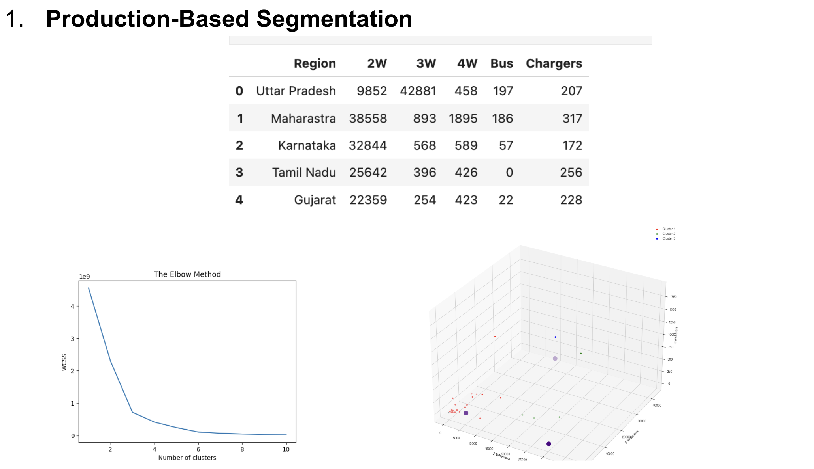
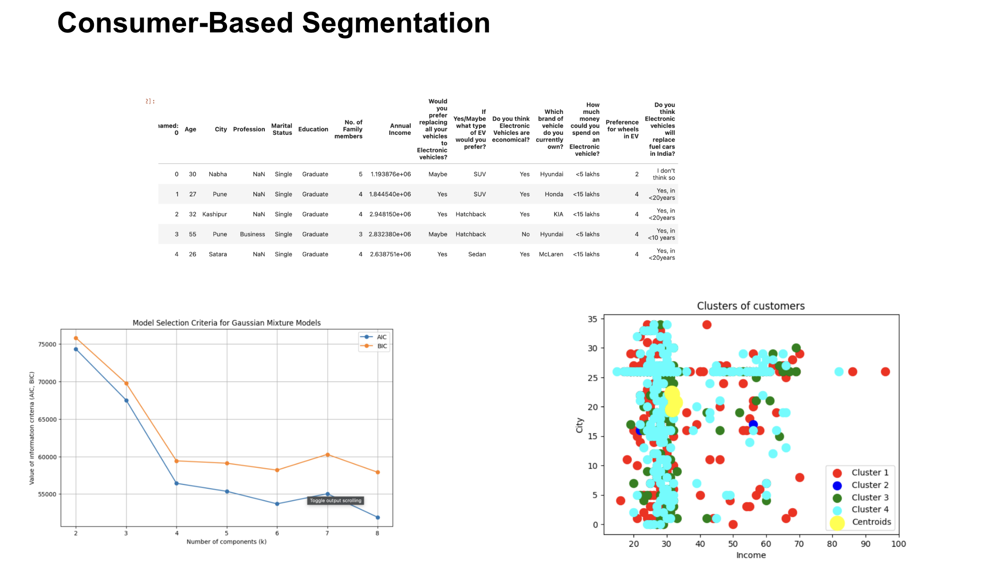
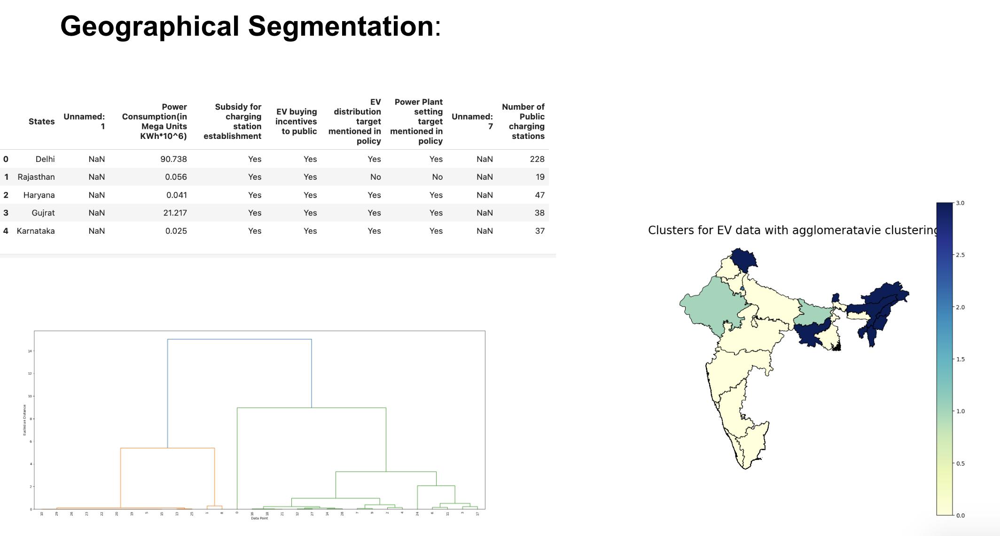

# EV-Market-Segmentation

---

## Motivation

The electric vehicle (EV) market in India is undergoing rapid transformation due to increasing environmental awareness, government initiatives like the FAME scheme, and advancements in EV technology. The need to understand market segments is crucial for strategizing EV adoption and infrastructure development.

---

## Introduction

This project explores three segmentation approaches for the Indian EV market:
1. **Production-Based Segmentation**: Categorizes EVs into two-wheelers, three-wheelers, four-wheelers, and e-buses.
2. **Consumer-Based Segmentation**: Identifies clusters based on consumer demographics and preferences using Gaussian Mixture Models (GMM).
3. **Geographical Segmentation**: Analyzes regional differences based on charging infrastructure and government policies using hierarchical clustering.

---

## Methodology

- **Production-Based Segmentation**:
  - Used **K-means clustering** with the **Elbow method**.
  - Identified 3 optimized clusters based on vehicle types.

- **Consumer-Based Segmentation**:
  - Applied **Gaussian Mixture Models (GMM)** for flexible clustering.
  - Achieved a silhouette score of **0.91**, indicating robust clusters.

- **Geographical Segmentation**:
  - Employed **hierarchical clustering** to analyze states based on:
    - Charging infrastructure.
    - Policy effectiveness.

---

## Results

Key findings:
- **Maharashtra and Delhi** emerge as potential markets for four-wheelers and charging infrastructure.
- **Consumer insights** reveal affordability and preference for SUVs and sedans, with a budget under ₹15 lakh.
- **Geographical Segmentation** highlights:
  - States like **Maharashtra**, **Telangana**, and **Karnataka** exhibit high EV adoption readiness.
  - **North Eastern states** and others show limited infrastructure and policy support.

---

## Conclusion

These findings provide actionable insights to:
- Guide market entry strategies for EV manufacturers.
- Drive targeted infrastructure expansion efforts.
- Shape policies for accelerated EV adoption across diverse market segments.
